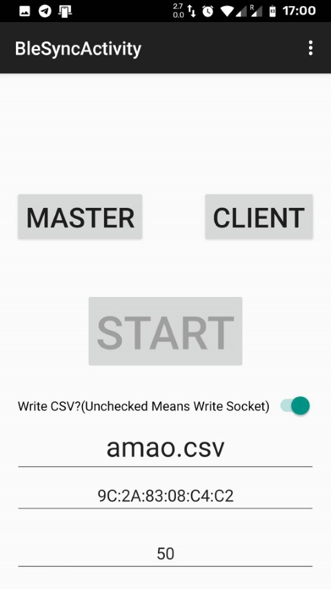

# FYPApplication (Android)

This Application is forked from LeoCai's project [Multi-Sensor-DataCollector](https://github.com/LeoCai/Multi-Sensor-DataCollector),
I use and modified [one of module](https://github.com/LeoCai/Multi-Sensor-DataCollector/tree/master/multi_sensor_collector) 
in the project.

## What I modified, what functions I added

LeoCai's original code can only let the client phone capture the data from the 
sensors. The master phone can only used to control the client start or stop recording.

According to the requirements of the project. My app allows both phones to record motion data synchronously.
The data will be saved singly as the csv file in phones.

To support the latest Android (Android 10), I also update the gradle version and the android version and remove some out-of-date not official supported functions

## Install

Install [**Install.apk**](./Install.apk) on two phones.

## Compile

Import [FYPApplication](./FYPApplication) to the Android Studio or Intellij IDEA as a Android project.

Update the *Android SDK Build Tools* to the latest version (in the SDK manager).

Then compile the project and debug the APP via the ADB.

## Use Guide

1.Install the app to two phones and make sure you open the bluetooth.
> Try to use two same model phones or same brand phones.
> Or the timestamp may different because of the frequency of 
> the different sensor may different. (**Very important**)

2.Find and copy the phones' bluetooth address.
> You can find it in the `Setting -> About phone`

3.On the Master phone, filling the client's bluetooth address in the address text box(the penultimate one)
The client phone fill the master's address in the box.

4.Filling the frequency on the master phone.
> About the frequency, I use the Android API to implement the function. So 
> the max value of the frequency supported based on your phone sensor's hardware.

5.When you make sure you have done all the above steps. Touch "Master" button on the master phone.
Touch "Client" on the client phone. Then wait they connect to each other. If everything going well,
the app will show "CONNECTED".

6.Filling the filename(with ".csv") on the master then click the "INIT FILE".

7.After confirm client show the "FILE INITED", you can start capturing by clicking "START".

8.You can find the csv file in the path `Android/data/com.assignment.amao.fypapplication/files` after you stop the capturing.

9.If you want restart, please reset the app (click the menu button on the top-right corner of th app)
